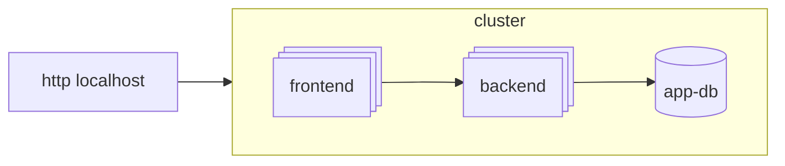

# app manifests



- `backend.yaml` and `frontend.yaml` - deployments and services for backend and frontend
- `backend-*.yaml` and `frontend-*.yaml` - additional tools
- `db.yaml` - MySQL database setup. In the cloud it should be outside of the cluster,
  but for local setup it's fine to keep it here.

## Deploy

```bash
kubectl -n dev apply .  # to deploy everything
kubectl -n dev get all  # list created resources

# check the "small load" logs (use '-f' to follow logs)
kubectl -n dev logs backend-small-load
kubectl -n dev logs frontend-small-load
```

Ingress serves just on localhost:

```bash
curl localhost  # should return home page html
curl localhost/api/posts  # should return posts in JSON format
```
